# VentureCue

> AI-powered founder rehearsal platform for realistic customer discovery and investor pitch practice.

---

## Problem

Early-stage founders often burn high-stakes opportunities—real prospective customers and venture investors—by practicing on them live. Unprepared founders frequently commit fatal conversational errors:
- **Premature Selling:** Pitching features before validating organic customer pain.
- **Leading Questions:** Prompting false positive confirmation ("Wouldn't it be great if...").
- **Unsubstantiated Metrics:** Making speculative market claims without defensible unit economics.
- **Surface-Level Probing:** Failing to uncover downstream consequences, workflow workarounds, and procurement hurdles.

---

## Solution

**VentureCue** provides a simulated sandbox where founders can practice critical founder-to-human dialogues before stakes are real. Founders rehearse with adaptive AI personas that simulate realistic workplace friction, skepticism, and partner-level investor scrutiny.

### Practice Modules
1. **Customer Discovery (The Mom Test Engine):** Rehearse 1-on-1 problem validation across 6 distinct customer archetypes. The AI simulates realistic day-to-day workflow realities, tools, and constraints, pushing back against leading questions and premature sales pitches.
2. **Investor Pitch Cross-Examination:** Rehearse partner-level Q&A across 3 distinct investor archetypes (Metrics VC, Skeptical VC, Product Angel), defending business model unit economics, market size, defensibility, and team execution.

---

## Core Features

- **Adaptive Personas:** 6 customer personas (The Skeptic, The Busy Operator, The Frustrated Manager, The Talkative User, The Polite Agree-er, The Indifferent Executive) and 3 investor personas.
- **NVIDIA NIM LLM Intelligence:** Powered by NVIDIA Cloud Functions running `meta/llama-3.2-11b-vision-instruct` for natural human-to-human conversation pacing and zero-leakage context isolation.
- **Interactive 3D Avatar:** Procedural Three.js avatar with real-time lip sync viseme analysis, blink cycles, and natural head idling.
- **Voice & Text Input Fallback:** Browser Web Speech recognition with graceful fallback to typed input.
- **Conversation Memory & Progressive Disclosure:** AI participants answer specific questions directly, reference earlier conversation context, and disclose deeper operational facts only when probed effectively.
- **Evidence-Based Evaluation:** Multi-dimensional scoring (Discovery Quality, Question Quality, Listening, Evidence Gathering) with timestamped quotes and actionable improvement drills.
- **Human Review & Immutable Audit Trail:** Human reviewers can accept, edit, or dispute AI diagnoses while preserving an immutable cryptographic audit snapshot.
- **Progress & Analytics:** Historical score trajectory, recurring weakness detection, and personalized next-practice recommendations.
- **Responsible AI Guardrails:** Prominent simulation transparency notices, strict prompt injection defense, and sensitive attribute protection.

---

## How It Works

```mermaid
flowchart LR
    A[Founder Voice / Text Input] --> B[Input Normalizer & STT Quality Check]
    B --> C[Persona World Model & System Prompt Builder]
    C --> D[NVIDIA NIM Cloud Function LLM]
    D --> E[Response Validator & Leakage Guardrails]
    E --> F[Avatar Lip Sync & Real-Time Transcript]
    F --> G[Post-Session Diagnostic Evaluator]
    G --> H[Human Review & Immutable Audit Trail]
    H --> I[Progress Analytics & Weakness Drills]
```



1. **Founder Input:** Captured via browser microphone (Web Speech API) or direct text input.
2. **Input Normalizer:** Sanitizes transcription hiccups, detects malformed fragments, and screens for prompt injection.
3. **Context Builder:** Constructs strictly isolated persona prompts with realistic private workplace constraints, grounded tools, and knowledge boundaries.
4. **NVIDIA NIM Generation:** Calls NVIDIA Cloud Function endpoint with conversational dialogue context.
5. **Response Validation:** Validates output against internal leakage, meta AI phrasing, and repetitive phrasing.
6. **Delivery & Audio Synthesis:** Avatar speaks via browser Web Speech synthesis with synchronized 3D lip visemes.
7. **Session Debrief:** Generates evidence-grounded performance report.

---

## Tech Stack

- **Frontend Core:** React 19, TypeScript, Vite
- **3D Avatar & Graphics:** Three.js, React Three Fiber (`@react-three/fiber`), `@react-three/drei`
- **State Management:** Zustand (with localStorage persistence)
- **AI Backend / Inference:** NVIDIA NIM (`meta/llama-3.2-11b-vision-instruct` via NVIDIA Cloud Functions)
- **Voice & Audio:** Web Speech API (SpeechRecognition + SpeechSynthesis)
- **Icons & UI:** Lucide React, Custom CSS Design System
- **Testing:** Custom zero-dependency Node/TypeScript automated test runner (`tsx`)

---

## Getting Started

### Prerequisites
- Node.js (v18 or higher)
- npm (v9 or higher)

### 1. Clone the Repository
```bash
git clone https://github.com/soumeshpan/VentureCue.git
cd VentureCue
```

### 2. Install Dependencies
```bash
npm install
```

### 3. Configure Environment
Copy the example environment file:
```bash
cp .env.example .env
```
Open `.env` and add your NVIDIA NIM API key (obtainable from [NVIDIA Build](https://build.nvidia.com/)):
```env
VITE_NVIDIA_API_KEY=nvapi-your_actual_key_here
VITE_NVIDIA_MODEL=meta/llama-3.2-11b-vision-instruct
```

> **Note on Client-Side Keys:** In this prototype application, the API key can be set via `VITE_NVIDIA_API_KEY` in `.env` or entered interactively under **Settings** in the web UI (stored in browser `localStorage`). In a production enterprise deployment, LLM calls should be routed through a dedicated backend API proxy.

### 4. Start the Local Development Server
```bash
npm run dev
```
Open your browser and navigate to `http://localhost:5173`.

---

## Testing

Run the automated test suite:
```bash
npm test
```

### Verified Test Suite Breakdown (61 Tests Passing):
- **Human Review & Audit Trail (6/6):** Verifies immutable AI snapshots, human dispute tracking, and reviewer edits.
- **Responsible AI, Safety & Trust (10/10):** Verifies simulation disclaimers, prompt injection defense, secret protection, and demographic neutrality.
- **Progress, Analytics & Weaknesses (14/14):** Verifies trajectory math, recurring weakness thresholds, human-edit precedence, and session recalculations.
- **End-to-End Integration & UX Polish (16/16):** Verifies discovery and pitch journeys, route integrity, debouncing, and NVIDIA provider integration.
- **Natural Conversation & Context Isolation (15/15):** Verifies tool sanitization, intent responsiveness, zero canned repetition, memory consistency, and persona differentiation.

---

## Production Build

To verify and compile the optimized production bundle:
```bash
npm run build
```

To preview the production build locally:
```bash
npm run preview
```

---

## Architecture & Project Structure

```
VentureCue/
├── public/                  # Static assets and favicon
├── src/
│   ├── assets/              # Avatar models and visual assets
│   ├── components/
│   │   ├── avatar/          # Three.js 3D avatar canvas & procedural visemes
│   │   ├── session/         # Transcript panel, mic controls, debug telemetry badge
│   │   ├── shared/          # Responsible AI modals, navigation, layout cards
│   │   └── ui/              # Button, Input, Card, Modal, TrustBadges
│   ├── data/                # Persona archetypes, drill recommendations
│   ├── hooks/               # useAvatar, useMicrophone, useSession, useSpeech
│   ├── pages/
│   │   ├── discovery/       # Discovery Setup, Live Session, Debrief
│   │   ├── pitch/           # Pitch Setup, Live Session, Debrief
│   │   ├── progress/        # Skill trajectories, recurring weaknesses, drills
│   │   ├── reviews/         # Human review audit trail and dispute workflow
│   │   ├── insights/        # Performance trends and persona breakdowns
│   │   └── settings/        # Account and live NVIDIA API key configuration
│   ├── providers/           # Avatar runtime providers (MockAvatarProvider)
│   ├── services/
│   │   ├── ai/              # NVIDIA NIM service, DiscoveryEngine, PitchEngine, Evaluator
│   │   │   └── context/     # CustomerPromptBuilder, PersonaWorldModel, ResponseValidator, InputNormalizer
│   │   └── analytics/       # Progress analytics, trajectory calculator, weakness detector
│   ├── store/               # Zustand stores (session, discovery, pitch, review, auth)
│   ├── styles/              # Global design tokens, animations, themes
│   ├── tests/               # 61 automated unit, integration, and behavioral tests
│   ├── types/               # TypeScript domain interfaces (session, discovery, pitch, review)
│   ├── App.tsx              # Router and top-level navigation
│   └── main.tsx             # React application entry point
├── .env.example             # Safe template for environment configuration
├── .gitignore               # Strict ignore rules for secrets and build artifacts
├── package.json             # Scripts and production dependencies
├── tsconfig.json            # Strict TypeScript configuration
└── vite.config.ts           # Vite build pipeline
```

---

## Responsible AI Safeguards & Material Limitations

1. **Simulation Disclaimer:** Simulated customer responses are practice tools and do not constitute actual market validation or commercial intent.
2. **Investor Reactions:** Simulated investor reactions reflect typical VC cross-examination heuristics and do not predict real-world fundraising outcomes.
3. **Browser-Native TTS/STT:** Speech recognition and avatar vocal synthesis utilize browser Web Speech APIs; quality may vary across browser vendors.
4. **Procedural 3D Visemes:** Avatar facial animations are procedurally generated visemes tied to synthetic speech phoneme timings rather than neural video generation.
5. **Client-Side Prototype Key:** API keys configured in the web UI are stored in the client's `localStorage` for prototype convenience. A production release should proxy inference through a secured backend.

---

## Project Context

- **Project:** VentureCue — AI-Powered Founder Practice Platform
- **Assignment:** Product Intern Assignment
- **Organization:** Kinetic Age
- **Author:** Soumesh Pan
- **Roll No:** 23052358
